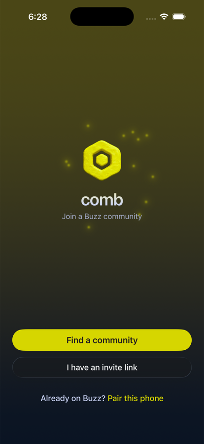
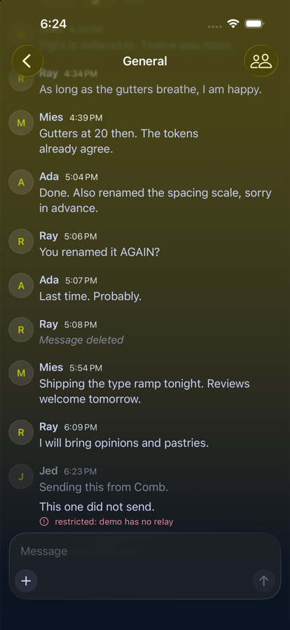
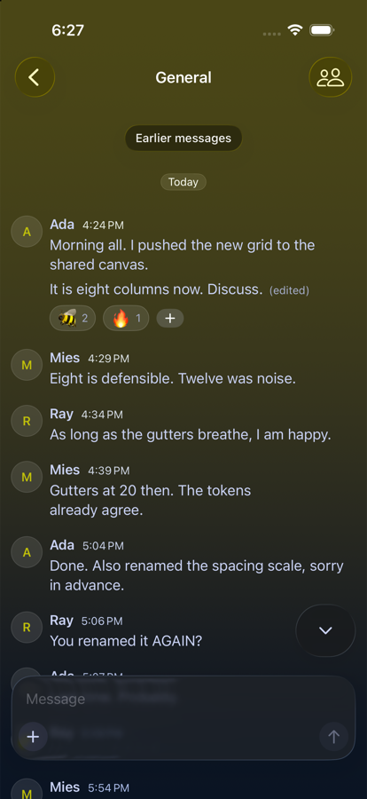

# Comb

**A native iOS client for [Buzz](https://github.com/block/buzz) communities.**

Channels, threads, and reactions on a relay you own. Your keys never leave your
phone.

<br clear="left">

[](https://github.com/jedbridges/comb/actions/workflows/ci.yml)
[](LICENSE)
[](https://swift.org)
[](https://developer.apple.com/ios/)

<p>
  
  
  
</p>

<sub>Screenshots use Comb's built-in demo data, not a real community.</sub>

---

## What is Buzz, and what is it for?

Every team chat you have used is someone else's server. Slack owns your history
and rents it back to you. Discord decides who is allowed in. In both, a bot is a
second-class citizen: it has a webhook, not a seat, and the audit trail treats it
as something that happened *to* the conversation rather than something in it.

[**Buzz**](https://github.com/block/buzz) is Block's answer to that: a
self-hostable workspace where humans and AI agents share the same rooms. Its own
description is *"a workspace where humans and agents build together, on a relay
you own."*

The mechanism is the interesting part. Buzz is a [Nostr](https://nostr.com)
relay, so every message, reaction, workflow step, review approval, and git event
is a signed event in one append-only log. Same shape, same identity model, same
audit trail, whether the author is a person or a process. An agent that opens a
pull request and a human who approves it are the same kind of participant with
different keypairs.

Two consequences follow, and they are why a third-party client like Comb can
exist at all:

- **You own the infrastructure.** A Buzz community is a relay at a URL. Run it
  yourself, or let someone host it. Either way the data is a log you can read
  without asking permission.
- **You own the identity.** Membership is a keypair, not a row in a vendor's
  users table. Any client that can sign an event can participate. Nothing about
  Buzz requires Buzz's own app.

Comb is the second half of that promise made real on iOS: an app nobody at Block
wrote, talking to communities nobody at Comb controls.

**Learn more about Buzz:** [buzz.xyz](https://buzz.xyz) ·
[github.com/block/buzz](https://github.com/block/buzz)

## Why Comb exists

Buzz ships an official mobile app. It is a companion to the desktop client: pair
with a QR code and carry your session in your pocket. That is a reasonable scope,
and it leaves a gap.

Invites get shared where people actually talk, in group chats and DMs, and those
are read on a phone. A client that can only extend an existing desktop session
cannot convert that tap. Comb can: it mints an identity at join, accepts an
invite pasted on the device, and can browse communities that have listed
themselves. It is also a deliberate proof that the protocol is open enough for
somebody else to build a real client on it.

Comb is an independent project and is not affiliated with Block, Inc.

## Design principles

These are constraints, not aspirations. Each one rules out implementations that
would otherwise be easier.

**Relay-agnostic.** No relay is hardcoded, privileged, or bundled. A community is
a URL the user supplies. Comb has no opinion about who runs it.

**Keys stay on the device.** Identity is a secp256k1 keypair in the Keychain,
stored `ThisDeviceOnly`, so it is never copied to iCloud or included in a backup.
Nothing is transmitted anywhere except signed events destined for the relay the
user chose. There is no Comb account, no Comb server, and no analytics.

**Standard NIP-29 first, Buzz extensions second.** Buzz defines kinds no other
Nostr software understands, such as `40002` rich content and `40003` edits. Comb
renders them when a relay provides them, and every one has a fallback so the app
stays fully usable against a relay that does not. A client that structurally
depends on one vendor's extensions is that vendor's client. See
`EventKind.isBuzzExtension`.

**Verify everything the relay says.** Events are checked by recomputing the id
from their contents *and* verifying the signature. Checking only the signature
would let a relay swap content while keeping a signature that still verifies over
the original id.

## Getting started

```bash
git clone https://github.com/jedbridges/comb.git
cd comb
make test        # package tests, no simulator, about a second
make run         # build, install, and launch on a booted simulator
```

Requires Xcode 26 and Swift 6.1 or later. `make project` regenerates the Xcode
project after changing `project.yml`; `Comb.xcodeproj` is generated and is not
checked in.

To try the app without joining anything, launch with `--demo` for a seeded
in-memory community.

## Architecture

```
CombCore/     Protocol, crypto, wire format. Foundation only.
CombStore/    The append-only event log, its projections, and the ingest
              choke point where verification happens. GRDB.
CombNet/      Relay connection and protocol state machine. Testable
              against a mock socket, with no relay.
Comb/         The iOS app target. SwiftUI only.
```

The load-bearing idea: the `event` table is the source of truth, append-only, and
everything else is a projection over it. Nostr events are immutable and
content-addressed, so the id is a natural primary key, dedupe is
`INSERT OR IGNORE`, and derived state can be dropped and rebuilt by replaying the
log. Fixing a projection bug costs a version bump and a local replay, not a
refetch from the relay.

Three of the four targets are Swift packages, so `make test` exercises the
protocol, storage, and relay state machine in about a second with no simulator.
That is where the subtle bugs are.

Two protocol details worth knowing if you are reading the code. **Edits and
deletions are authorised at read time**, not at ingest: a kind 5 only erases its
own author's events and a kind 40003 only rewrites its author's own, because both
arrive validly signed and hosted Buzz's server-side checks do not exist on a plain
NIP-29 relay. And **images are re-encoded before upload**, never passed through,
because a photo out of the library carries EXIF that routinely includes GPS.

## Status

Working against live Buzz communities. Builds are uploaded to TestFlight and
internal testing is running; see [docs/TESTFLIGHT.md](docs/TESTFLIGHT.md) for the
release path.

**Protocol and storage**

- [x] Hex, bech32, NIP-19 `npub` / `nsec`
- [x] secp256k1 keys, BIP-340 signing and verification
- [x] NIP-01 events, canonical serialization, id computation, validation
- [x] Filters including dynamic tag filters and p-gated kind detection
- [x] Client and relay wire messages, NIP-42 auth events
- [x] NIP-98 HTTP auth, Blossom BUD-01/02 media auth, signer abstraction
- [x] Append-only event log, verified ingest, rebuildable projections
- [x] Timeline queries with stable pagination, and the optimistic send outbox
- [x] Relay connection, NIP-42 auth, subscriptions, reconnection

**The app**

- [x] Channel list with unread state, message history, sending
- [x] Onboarding, community discovery with search and sorting
- [x] Keychain storage and the `nostrpair://` pairing handshake
- [x] Threads, reactions with a full emoji picker, editing and deleting
- [x] Mentions: `@name` autocomplete, highlighting, and `p` tags
- [x] Images: Blossom upload, inline rendering, metadata stripped before send
- [x] Search, profiles, member lists, link detection, date separators
- [x] Zaps (NIP-57) by `lightning:` deep link
- [x] Reporting (NIP-56) and local blocking
- [x] Mention notifications by background refresh, and local reminders
- [x] Deep links to a message, by `buzz://message` URL
- [ ] Typing indicators and presence
- [ ] Video playback for received attachments
- [ ] Nostr Wallet Connect (NIP-47) for in-app zaps

### Notifications, honestly

There is no real push, and there cannot be one today. Buzz's hosted push gateway
verifies Apple App Attest against a single hardcoded app identifier, so no
third-party client can register with it. Making that list configurable is an
upstream change worth proposing.

What Comb does instead: iOS wakes the app periodically, it syncs, and it posts a
*local* notification for anything that mentioned you. No server is involved. The
cost is latency, and the app says so in Settings rather than implying otherwise.

## Privacy

Comb has no backend. It talks to the relay you point it at and nowhere else. No
analytics, no crash reporting, no third-party SDKs beyond a local database
library. See [PRIVACY.md](PRIVACY.md).

One caveat worth stating plainly rather than being caught out on: builds
distributed through TestFlight or the App Store have crash reports collected by
Apple, gated by your device's own diagnostics setting. That is a property of
Apple's distribution, not something Comb opts into, and an app cannot disable it.
For diagnosing problems, Comb keeps a local log you can read and send yourself
from Settings.

## Correctness

The canonical serializer decides event ids, and an id that disagrees with other
implementations by one byte makes every event Comb produces unverifiable
everywhere else. So the expected ids in `CanonicalJSONTests` were generated by an
independent Python implementation rather than by this code, covering quotes,
backslashes, control characters, non-BMP emoji, and accented characters. The
bech32 vectors were cross-checked the same way, and the `nsec` vector is the one
published in the NIP-19 specification.

## Contributing

Contributions are welcome. See [CONTRIBUTING.md](CONTRIBUTING.md) for the
workflow, and [SECURITY.md](SECURITY.md) for reporting a vulnerability.

To list a community in Comb's browse screen, no code is required:
[open a listing request](https://github.com/jedbridges/comb/issues/new?template=list-community.yml).

## Design

Comb borrows Buzz's palette, type scale, radii, and motion tokens so it feels like
part of the same world. It does not use Buzz's name or its bee mark: Buzz is
Apache 2.0, and section 6 of that license withholds trademark rights. Comb's mark
is its own. See [DESIGN.md](DESIGN.md).

## License

MIT. See [LICENSE](LICENSE).
